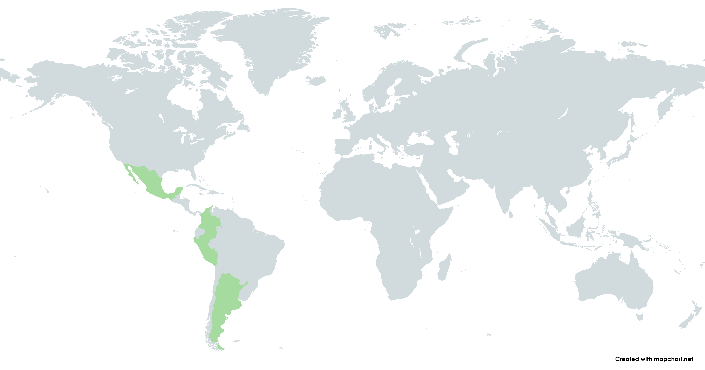

<h1 align="center">LatAm Covid-19 Analysis</h1>

<p align="center">
    <a href="https://github.com/mariomttz/latam-covid19-analysis?tab=MIT-1-ov-file">
        
    </a>
    
</p>



<h2>1. Description</h2>

This project aims to create an interactive dashboard that shows different statistics of Covid-19 open data from Latin American countries, to carry out this task we will use the Python programming language, some data science processes, ETL for example, statistical tools and visualization techniques. This with the objective of being able to make decisions based on the graphs and trends that will be shown in our dashboard.

<h2>2. Installation & Dependencies</h2>

To download this project locally follow the commands below.

```bash
git clone https://github.com/mariomttz/latam-covid19-analysis.git
```

```bash
cd latam-covid19-analysis
```

And install all the necessary dependencies for this project. Remember to first create a virtual environment.

```bash
pip install -r requirements.txt
```

<h3>Folder Structure </h3>

```
.
├── data/
│   ├── argentina/
│   ├── colombia/
│   ├── mexico/
│   └── peru/
├── docs/
│   ├── img/
│   ├── pdf/
│   └── static/
├── pipeline/
├── .gitignore
├── requirements.txt
├── LICENSE.md
└── README.md
```
<h2>3. Development Status</h2>
This project is currently in <b>development</b>.

<h2>4. License</h2>
This repository is under the MIT license. See the <b><a href="https://github.com/mariomttz/latam-covid19-analysis?tab=MIT-1-ov-file">LICENSE</a></b> file for details.